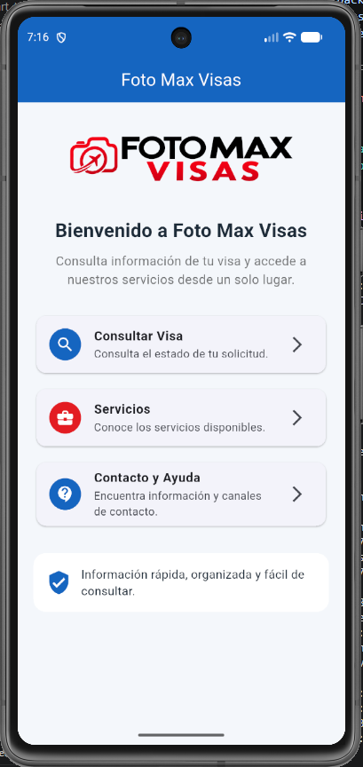
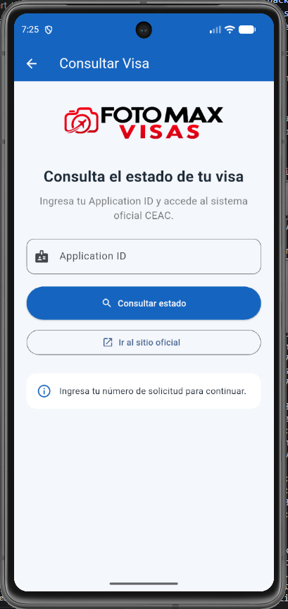
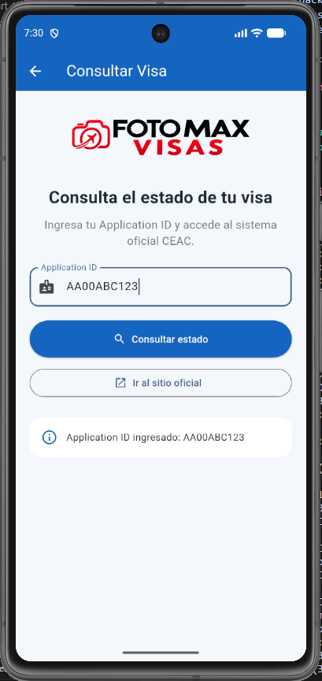
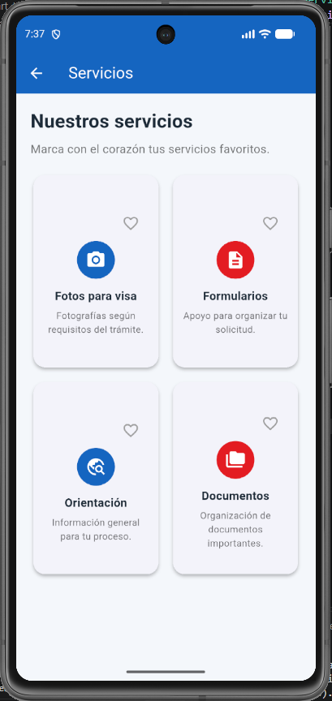
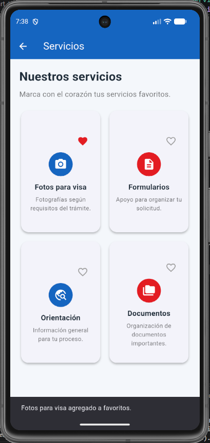
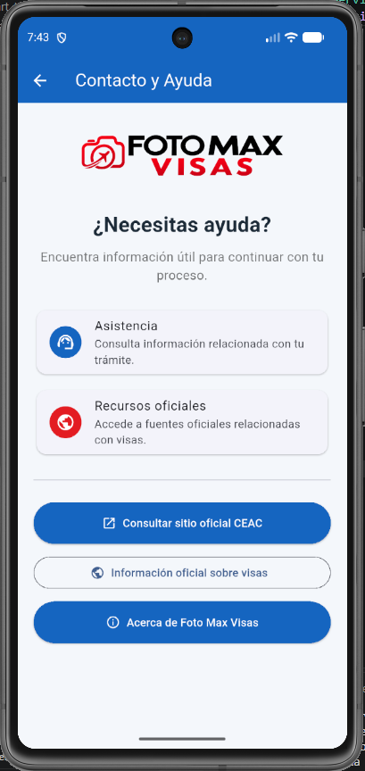
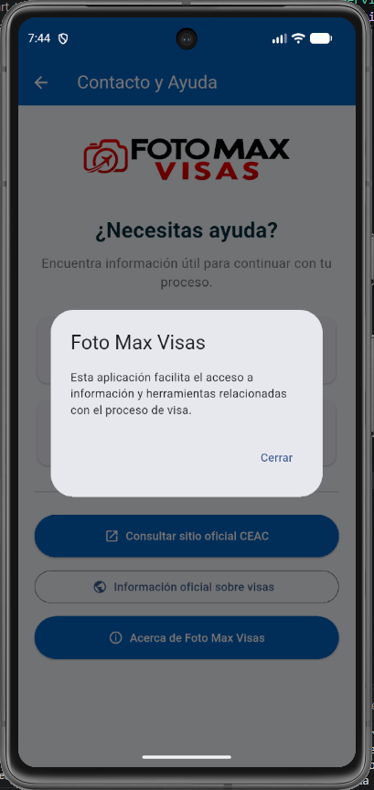
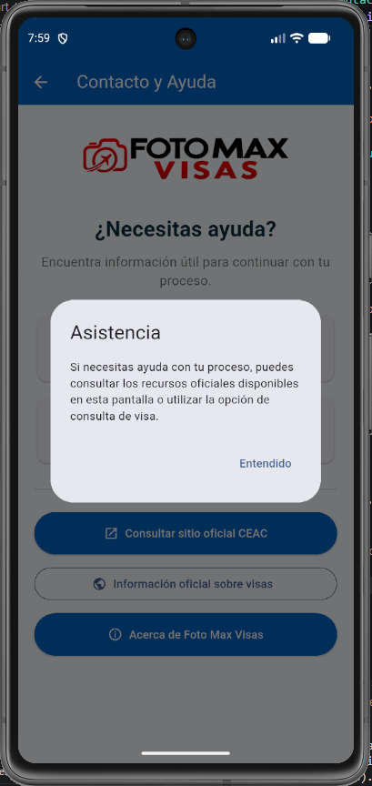

# Foto Max Visas

Aplicación móvil desarrollada en Flutter como proyecto académico.

## Descripción

La aplicación permite al usuario ingresar un Application ID y preparar una consulta relacionada con el estado de una visa.

También incluye acceso directo al sitio oficial CEAC mediante el paquete externo `url_launcher`.

## Tecnologías utilizadas

- Flutter
- Dart
- Android Studio
- Visual Studio Code
- Git
- GitHub

## Funcionalidades

- Interfaz desarrollada con Material Design.
- Campo para ingresar Application ID.
- Botón para consultar estado.
- Mensaje dinámico mediante `setState`.
- Acceso al sitio oficial CEAC.
- Uso del paquete externo `url_launcher`.
- Ejecución en emulador Android Pixel 7.

## Control de versiones

El proyecto fue desarrollado utilizando Git y GitHub, registrando los avances mediante diferentes commits.

## Autor

Carlos Andres Barberan


---

# Actividad Integradora 2

## Desarrollo de una Aplicación Flutter con Navegación y Nuevos Widgets

### Descripción

Para la Actividad Integradora 2 se continuó mejorando la aplicación **Foto Max Visas**, desarrollada originalmente en la Actividad Integradora 1.

En esta nueva versión se incorporaron nuevas pantallas, navegación mediante `Navigator`, nuevos widgets de Flutter, interacciones con el usuario, manejo de estado mediante `setState()`, uso de un paquete externo y una mejor organización del proyecto mediante carpetas.

---

## Nuevas funcionalidades

La aplicación ahora cuenta con:

- Pantalla principal de bienvenida.
- Navegación entre diferentes pantallas mediante `Navigator.push`.
- Consulta de visa mediante Application ID.
- Acceso al portal oficial CEAC.
- Catálogo de servicios mediante `GridView`.
- Sistema de servicios favoritos.
- Cambio visual del icono de favorito mediante `setState()`.
- Mensajes mediante `SnackBar`.
- Ventanas informativas mediante `AlertDialog`.
- Pantalla de contacto y ayuda.
- Acceso a recursos oficiales externos mediante `url_launcher`.
- Diseño personalizado con logo, colores e icono de Foto Max Visas.

---

## Pantallas de la aplicación

### 1. Inicio

Es la pantalla principal de la aplicación. Presenta el logo de Foto Max Visas y permite acceder a las demás funciones.

Desde esta pantalla se puede navegar hacia:

- Consultar Visa
- Servicios
- Contacto y Ayuda



---

### 2. Consultar Visa

Permite ingresar un `Application ID` y acceder al sistema oficial CEAC para consultar el estado de una solicitud.

La pantalla utiliza `setState()` para modificar el mensaje mostrado al usuario después de ingresar el número de solicitud.





---

### 3. Servicios

Presenta diferentes servicios mediante un `GridView`.

Cada servicio utiliza una tarjeta reutilizable desarrollada en el archivo:

`lib/widgets/service_card.dart`

El usuario puede marcar o desmarcar servicios como favoritos mediante un botón con forma de corazón.





---

### 4. Contacto y Ayuda

Esta pantalla contiene recursos de ayuda e información para el usuario.

Permite:

- Consultar asistencia.
- Mostrar información mediante `AlertDialog`.
- Acceder al sitio oficial CEAC.
- Acceder a información oficial sobre visas.
- Consultar información acerca de Foto Max Visas.







---

## Navegación

La navegación entre las pantallas se realiza mediante:

```dart
Navigator.push(
  context,
  MaterialPageRoute(
    builder: (context) => const ConsultaScreen(),
  ),
);

---

# Actividad Integradora 3

## Foto Max Visas - Provider y componentes reutilizables

### Descripción

Para esta actividad continué mejorando la aplicación **Foto Max Visas** desarrollada en las actividades anteriores.

En esta versión organicé mejor el proyecto e implementé manejo de estado con el paquete **Provider**. La función principal trabajada fue el sistema de servicios favoritos, de manera que un cambio realizado en la pantalla de Servicios se refleja también en Favoritos y en la pantalla principal.

### Objetivo

Aplicar manejo de estado con Provider, separar el código según su responsabilidad, utilizar modelos de datos y crear componentes reutilizables sin concentrar toda la aplicación en `main.dart`.

## Funcionalidades principales

- Consulta de información relacionada con visas.
- Acceso al sitio oficial CEAC.
- Catálogo de servicios mediante `GridView.builder`.
- Agregar y eliminar servicios favoritos.
- Estado compartido entre las pantallas Servicios, Favoritos e Inicio.
- Contador dinámico de servicios favoritos.
- Pantalla de ayuda y recursos oficiales.
- Navegación mediante `Navigator.push()` y `Navigator.pop()`.
- Apertura de enlaces externos mediante `url_launcher`.

## Tecnologías y paquetes utilizados

- Flutter
- Dart
- Material Design
- Git y GitHub
- `provider`
- `url_launcher`

## Estructura del proyecto

El código fue separado en carpetas de acuerdo con su responsabilidad:

```text
lib/
├── constants/
│   └── app_colors.dart
├── data/
│   └── services_data.dart
├── models/
│   └── service.dart
├── providers/
│   └── favorites_provider.dart
├── screens/
│   ├── consulta_screen.dart
│   ├── contacto_screen.dart
│   ├── favoritos_screen.dart
│   ├── home_screen.dart
│   └── servicios_screen.dart
├── widgets/
│   ├── favorite_button.dart
│   └── service_card.dart
└── main.dart